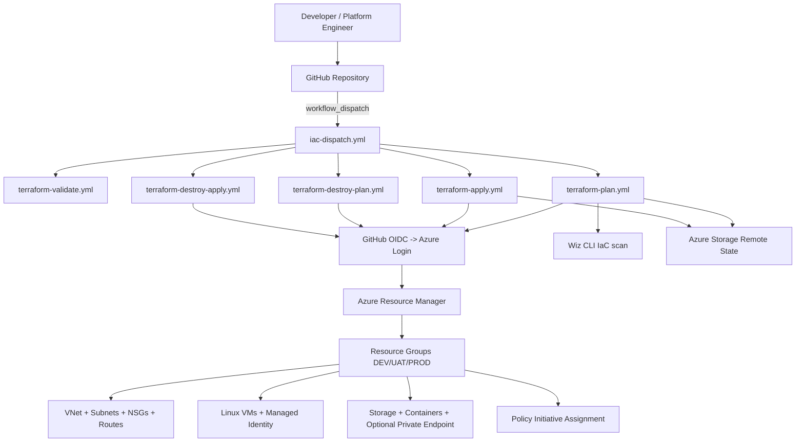

# terraform-azure-platform

Enterprise-grade Azure Infrastructure-as-Code platform using Terraform + GitHub Actions, designed for multi-environment DevSecOps delivery with governance controls, reusable modules, and policy enforcement.

## Architecture Overview



## Repository Structure

```text
terraform-azure-platform/
├── modules/
│   ├── governance/
│   ├── storage/
│   ├── vm/
│   └── vnet/
├── environments/
│   ├── dev/
│   ├── uat/
│   └── prod/
├── docs/
├── tests/
├── governance/
├── .github/workflows/
├── .tflint.hcl
├── .pre-commit-config.yaml
├── Makefile
├── versions.tf
├── providers.tf
└── README.md
```

## Network Architecture & CIDR Strategy

- DEV: `10.10.0.0/16`
- UAT: `10.15.0.0/16`
- PROD: `10.20.0.0/16`

Each environment uses subnet segmentation:
- `management-subnet`
- `application-subnet`
- `data-subnet`
- `private-endpoint-subnet`
- `future-reserved-subnet`

Design rationale:
- Non-overlapping `/16` ranges reduce peering/VPN/ExpressRoute collision risk.
- Reserved subnet supports growth without renumbering.
- Data/private endpoint subnet isolation improves blast-radius control.
- Future-ready for hub-spoke peering and hybrid routing policies.

## Naming Standard

Naming is centralized via `locals` in each environment:
- `rg-opella-dev-eastus`
- `vnet-opella-dev-eastus`
- `vm-opella-dev-eastus-001`
- `stopelladeveus001`

## Tagging Strategy

Common tags merged with workload tags via `merge()`:
- Environment
- Project
- ManagedBy
- Owner
- CostCenter
- Region
- Application

Benefits:
- Cost allocation and FinOps reporting
- Mandatory metadata for policy compliance
- Traceability and operational ownership

## Governance Strategy

The governance module deploys:
- Require Tags policy
- Allowed Regions policy
- Deny Public IP policy
- Initiative: `Opella-Governance-Baseline`
- Assignment scoped to each environment resource group

Future OPA approach: add policy-as-code gate in CI alongside Azure Policy runtime enforcement.

## Security Controls

- GitHub OIDC federation only (no client secret)
- Azure RBAC least privilege for federated SPN
- Remote state in Azure Storage backend configured from GitHub Environment Secrets
- HTTPS-only storage, no public blob access, encryption at rest
- Wiz CLI IaC scan in plan pipeline
- TFLint + terraform validate in CI

## OIDC Configuration Guide

1. Create Azure AD App Registration.
2. Add federated credentials for GitHub repo+environment combinations (`DEV`, `UAT`, `PROD`).
3. Assign RBAC:
   - `Contributor` (or custom least-privilege role) at scoped subscription/resource group.
   - `Storage Blob Data Contributor` for backend state account if separate.
4. Configure GitHub Environment Variables:
   - `AZURE_CLIENT_ID`
   - `AZURE_TENANT_ID`
   - `AZURE_SUBSCRIPTION_ID`

## GitHub Environment Configuration

Create environments: `DEV`, `UAT`, `PROD`.
- Enable required reviewers for `PROD` to enforce manual approval.

Environment Variables:
- `AZURE_CLIENT_ID`: app registration client ID
- `AZURE_TENANT_ID`: Entra tenant ID
- `AZURE_SUBSCRIPTION_ID`: target subscription ID

Environment Secrets:
- `TF_BACKEND_RESOURCE_GROUP`: state RG name
- `TF_BACKEND_STORAGE_ACCOUNT`: state storage account
- `TF_BACKEND_CONTAINER`: state container
- `TF_BACKEND_KEY`: tfstate object key per env
- `WIZ_CLIENT_ID`: Wiz API identity
- `WIZ_CLIENT_SECRET`: Wiz API secret
- `EXTRA_ARGS`: optional additional terraform CLI arguments

## Backend Configuration

Backend block is partial; all values are injected at `terraform init` time by workflows.

Example:

```bash
terraform init \
  -backend-config="resource_group_name=$TF_BACKEND_RESOURCE_GROUP" \
  -backend-config="storage_account_name=$TF_BACKEND_STORAGE_ACCOUNT" \
  -backend-config="container_name=$TF_BACKEND_CONTAINER" \
  -backend-config="key=$TF_BACKEND_KEY"
```

## Deployment Steps

1. Push branch.
2. Trigger `iac-dispatch.yml`.
3. Choose environment and action (`validate`, `plan`, `plan-apply`, destroy actions).
4. Review plan artifact and PR comment.
5. Approve `PROD` environment when applying.

## Module Usage

See `environments/*/main.tf` for full examples using VNet, VM, Storage, Governance modules.

## Testing Strategy

Terratest examples in `tests/` validate:
- VNet creation
- Subnet creation count
- Output shape correctness

## Interview Talking Points

- Why OIDC over SP secrets
- Lifecycle guardrails (`prevent_destroy`, `create_before_destroy`, `ignore_changes`)
- Policy initiative design for scalable governance
- Environment promotion using reusable workflow primitives
- Security shift-left with Wiz + lint + validation

## Future Enhancements

- Add Sentinel/OPA policy checks in CI
- Introduce private DNS zone modules and hub-spoke transit module
- Add module versioning and release automation
- Add drift detection scheduled workflows
