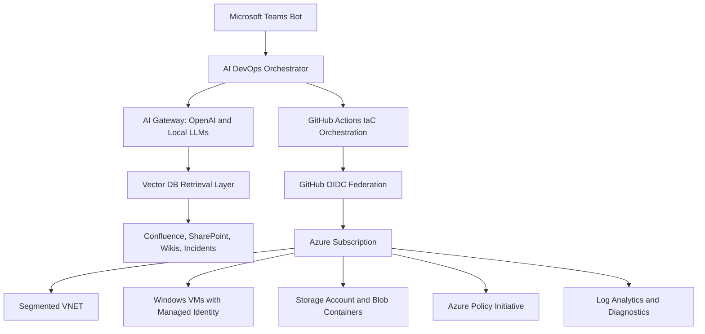

# Terraform Azure Platform

Enterprise-grade Azure Infrastructure-as-Code platform for the Opella AI-driven DevOps orchestration ecosystem. It provisions segmented networking, Windows compute, private storage, Azure Policy governance, monitoring hooks, and GitHub Actions CI/CD using Terraform modules and OIDC-only Azure authentication.

## Architecture Overview

For a direct mapping of the assessment requirements to the implementation, see:

```text
docs/assessment-guide.md
```



The infrastructure layer is intentionally private-first. Workloads land in environment-specific VNETs, storage is protected by firewall rules and Private Endpoint, Windows VMs use private RDP access and managed identity, and governance is assigned as Azure Policy initiatives.

## Repository Structure

```text
terraform-azure-platform/
├── modules/
│   ├── vnet/
│   ├── vm/
│   ├── storage/
│   └── governance/
├── environments/
│   ├── dev/
│   ├── uat/
│   └── prod/
├── docs/
├── tests/
├── governance/
├── .github/workflows/
├── .tflint.hcl
├── .pre-commit-config.yaml
├── Makefile
├── versions.tf
├── providers.tf
└── README.md
```

## Network Strategy

| Environment | CIDR |
| --- | --- |
| DEV | `10.10.0.0/16` |
| UAT | `10.15.0.0/16` |
| PROD | `10.20.0.0/16` |

Each environment uses management, application, data, private endpoint, and future-reserved subnets. The third octet is reserved by function, which keeps route tables, firewall rules, and peering plans predictable. Non-overlapping `/16` ranges preserve hybrid connectivity and hub-spoke peering readiness.

## Naming and Tagging

Names are centralized in environment `locals`:

- Resource group: `rg-opella-dev-eastus`
- VNET: `vnet-opella-dev-eastus`
- VM: `vm-opella-dev-eastus-001`
- Storage: `stopelladeveus001`

Common tags are built with `merge()` and applied consistently:

`Environment`, `Project`, `ManagedBy`, `Owner`, `CostCenter`, `Region`, `Application`

This supports Azure Policy compliance, ownership, cost allocation, chargeback, and incident triage.

## Module Usage Examples

```hcl
module "network" {
  source = "../../modules/vnet"

  resource_group_name = azurerm_resource_group.this.name
  location            = azurerm_resource_group.this.location
  vnet_name           = "vnet-opella-dev-eastus"
  address_space       = ["10.10.0.0/16"]
  tags                = local.common_tags

  subnets = {
    management = {
      name             = "management-subnet"
      address_prefixes = ["10.10.0.0/24"]
    }
  }
}
```

```hcl
module "storage" {
  source = "../../modules/storage"

  resource_group_name  = azurerm_resource_group.this.name
  location             = azurerm_resource_group.this.location
  storage_account_name = "stopelladeveus001"
  containers = {
    artifacts = { name = "artifacts" }
    logs      = { name = "logs" }
  }
}
```

## Terraform Patterns Used

- `locals` centralize naming, tags, CIDRs, and environment conventions.
- `for_each` creates multiple subnets, NSGs, VMs, containers, policy rules, and disks deterministically.
- `dynamic` blocks support subnet delegations, DDoS, storage lifecycle rules, private DNS groups, and route definitions.
- `validation` blocks enforce naming, environment, and allowed value contracts.
- `lifecycle` blocks protect critical resources:
  - `prevent_destroy` on VNET, resource group, storage, and VM avoids accidental deletion of foundational or stateful assets.
  - `create_before_destroy` on replaceable network resources reduces outage risk.
  - `ignore_changes` for operational tags avoids noisy drift from patching or inventory systems.
- `depends_on` is avoided except where Terraform cannot infer dependency order. Current dependencies are expressed through references.

## Governance Strategy

The governance module creates custom policies for:

- Required tags
- Allowed regions
- Deny Public IP

These are grouped into the `Opella-Governance-Baseline` initiative and assigned to each environment resource group. DEV and UAT use `DoNotEnforce` to support adoption and testing; PROD uses `Default` enforcement.

Azure Policy provides runtime guardrails. Future OPA integration can add pre-plan policy checks in CI using Conftest or Checkov without replacing Azure Policy.

## Security Controls

- GitHub OIDC federation only, no Azure client secrets.
- Windows VM local administrator password is supplied as sensitive Terraform input.
- RDP is restricted to private enterprise address space by NSG rule.
- Managed identity enabled for VMs.
- Public IPs disabled by default.
- Storage HTTPS-only, TLS 1.2, public blob access disabled, soft delete and versioning enabled.
- Storage firewall denies by default with selected subnet access.
- Optional Private Endpoint and Private DNS for blob access.
- Wiz IaC scan runs before plan artifact publication.
- PROD apply and destroy require GitHub Environment approval.

## GitHub Actions Design

`iac-dispatch.yml` is the enterprise entrypoint. It routes actions to reusable workflows:

| Dispatch action | Workflow behavior |
| --- | --- |
| `validate` | fmt, init, validate, terraform-docs check, TFLint |
| `plan` | init, validate, TFLint, Wiz scan, plan, artifact upload |
| `plan-apply` | plan, then apply the saved binary plan |
| `destroy-plan` | create destroy plan artifact |
| `destroy-apply` | destroy plan, then approved destroy apply |

Optional inputs support audited state operations: force unlock, import, state remove, and extra Terraform arguments.

## Backend Configuration

Every environment has:

```hcl
terraform {
  backend "azurerm" {}
}
```

Backend values are supplied at runtime from GitHub Environment secrets:

```bash
terraform init \
  -backend-config="resource_group_name=$TF_BACKEND_RESOURCE_GROUP" \
  -backend-config="storage_account_name=$TF_BACKEND_STORAGE_ACCOUNT" \
  -backend-config="container_name=$TF_BACKEND_CONTAINER" \
  -backend-config="key=$TF_BACKEND_KEY"
```

## Deployment Steps

1. Bootstrap the remote state storage account and blob container.
2. Create Azure app registration and federated credentials for `DEV`, `UAT`, and `PROD`.
3. Assign required Azure RBAC roles.
4. Configure GitHub Environments, variables, and secrets.
5. Run `IaC Dispatch` with `validate`.
6. Run `plan`.
7. Run `plan-apply`; PROD pauses for manual approval.

## Required Variables

| Variable | Purpose |
| --- | --- |
| `admin_password` | Sensitive Windows VM local administrator password. |
| `WINDOWS_ADMIN_PASSWORD` | GitHub Environment secret injected as `TF_VAR_admin_password` during plan and destroy-plan workflows. |
| `AZURE_CLIENT_ID` | GitHub Environment variable for OIDC login. |
| `AZURE_TENANT_ID` | GitHub Environment variable for tenant context. |
| `AZURE_SUBSCRIPTION_ID` | GitHub Environment variable for subscription context. |

## Optional Variables

| Variable | Purpose |
| --- | --- |
| `owner` | Tagging and ownership metadata. |
| `cost_center` | FinOps and chargeback metadata. |
| `allowed_locations` | Azure Policy allowed locations. |
| `EXTRA_ARGS` | Optional workflow-controlled Terraform CLI arguments. |

## Outputs

Environment outputs include resource group name, VNET ID, subnet IDs, storage account name, VM private IPs, and governance assignment ID.

## Testing Strategy

Terratest examples in `tests/` deploy a fixture resource group and VNET module, then validate subnet names and output IDs. CI quality gates add `terraform fmt`, `terraform validate`, TFLint, terraform-docs validation, policy JSON checks, and Wiz IaC scanning.

Run locally:

```bash
cd tests
go test ./... -timeout 45m
```

## Release Lifecycle

- Feature branches run validation and policy checks through pull requests.
- DEV validates module changes quickly.
- UAT validates release candidates with production-like workflow controls.
- PROD deploys from protected branches with required approval.
- Destroy is intentionally split into plan and apply to preserve review and auditability.

## Future Enhancements

- Add Azure Firewall, Bastion, and hub-spoke peering modules.
- Add Key Vault with private endpoint and RBAC-only access.
- Add Azure Monitor alert rules and action groups.
- Add OPA/Conftest CI checks for organization-specific policy-as-code.
- Add module publishing and semantic versioning through GitHub Releases.
- Extend RAG platform services with Azure Container Apps or AKS modules.

## Documentation

- [Environment setup](docs/environment-setup.md)
- [OIDC setup](docs/oidc-setup.md)
- [GitHub environments](docs/github-environments.md)
- [Network architecture](docs/network-architecture.md)
- [Interview talking points](docs/interview-talking-points.md)

<!-- BEGIN_TF_DOCS -->
Terraform-docs compatible sections are maintained in each module README.
<!-- END_TF_DOCS -->
